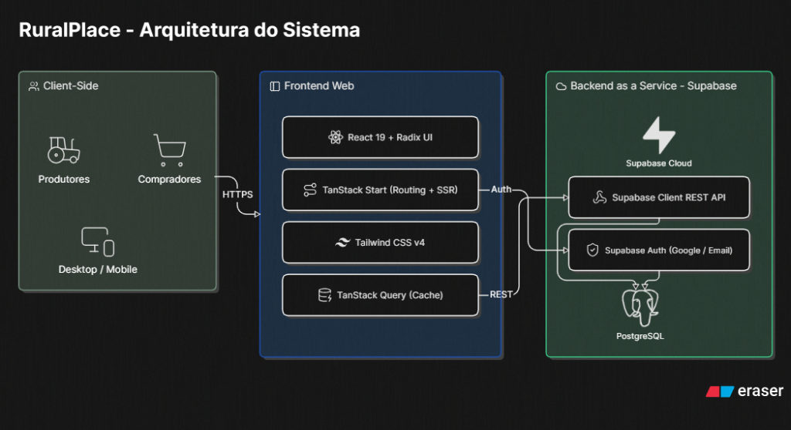

# RuralPlace

## i) Identificação
**Equipe:** A volta dos que não foram

**Integrantes:**
- Lorenzo Facco - Programador
- Kauã Saraiva - PO
- Augusto Pasetto - Editor
- Henrique Beladona - Produtor
- Luiz Mariano - UI/UX Designer


## ii) Escopo do Projeto
**O Problema:** 
O mercado de negociação de animais de fazenda (bovinos, equinos, ovinos, etc.) muitas vezes carece de plataformas modernas, rápidas e seguras. A comunicação entre produtores e compradores costuma ser fragmentada em grupos de WhatsApp ou redes sociais, dificultando a busca por animais específicos, o filtro por localização e a garantia de informações organizadas.

**A Solução:** 
O **RuralPlace** é um marketplace focado exclusivamente no agronegócio brasileiro. A plataforma centraliza a compra e venda de animais, permitindo que produtores anunciem lotes ou unidades com fotos, detalhes de raça, peso, localização e preço. Compradores podem filtrar ofertas facilmente por categoria e entrar em contato direto com o vendedor, criando um ecossistema seguro e direto para os negócios rurais.

---

## iii) Stack Tecnológica
A aplicação foi construída visando alta performance e escalabilidade, utilizando tecnologias de ponta do ecossistema JavaScript/TypeScript:

**Linguagem:** 
- TypeScript (Superset de JavaScript para tipagem estática segura)

**Frameworks & Bibliotecas (Frontend):**
- **React 19:** Biblioteca principal para interfaces de usuário.
- **TanStack Start & Router:** Framework Full-Stack para React com renderização no servidor (SSR) e roteamento tipado.
- **Vite:** Ferramenta de build e servidor de desenvolvimento ultra-rápido.
- **Tailwind CSS v4:** Framework utilitário para estilização e design responsivo.
- **React Query (TanStack Query):** Gerenciamento e cache de estado assíncrono.
- **Radix UI & Lucide React:** Componentes acessíveis e biblioteca de ícones.

**Backend & Banco de Dados (BaaS):**
- **Supabase:** Plataforma Backend-as-a-Service (BaaS) open-source.
- **PostgreSQL:** Banco de dados relacional robusto para armazenar os anúncios e perfis.
- **Supabase Auth:** Gerenciamento de sessões e autenticação (Login via Google e Email/Senha).

---

## iv) Arquitetura

Abaixo está o modelo da arquitetura técnica da solução:



## v) Situação do Projeto

**O que já foi implementado (Concluído):**
- [x] Autenticação de usuários (Login por e-mail, senha e Google via Supabase OAuth).
- [x] Listagem dinâmica e vitrine de anúncios na página inicial.
- [x] Sistema de filtragem e separação de anúncios por categorias (Bovinos, Equinos, etc.).
- [x] Fluxo de criação de anúncios (inserção de título, preço, raça, localização, foto por URL).
- [x] Painel de gerenciamento "Meus Anúncios" (Ativar, pausar e excluir anúncios).
- [x] Visualização detalhada do anúncio com integração direta para contato via WhatsApp do vendedor.

**Requisitos planejados (A fazer):**
- [ ] Sistema de favoritar anúncios (Salvar anúncios na conta).
- [ ] Edição completa de um anúncio já publicado.
- [ ] Chat interno na plataforma entre comprador e vendedor.


## Vídeo do Pitch

**Link:** https://youtu.be/7KrzKpEzerw

---

## vi) Guia de Instalação e Execução

Para rodar a aplicação localmente na sua máquina, siga os passos abaixo:

1. **Baixe o projeto**: Faça o download do arquivo ZIP do repositório.
2. **Extraia os arquivos**: Descompacte (unzip) a pasta em um local de sua preferência.
3. **Instale as dependências**: Abra o terminal na raiz do projeto e execute o comando:
   ```bash
   npm install
   ```
4. **Configure as variáveis de ambiente**:
   - Crie um arquivo chamado `.env` na raiz do projeto usando o `.env.example` como base.
   - Preencha as variáveis com as suas credenciais de banco (Supabase).
5. **Rode a aplicação**: Por último, inicie o servidor com:
   ```bash
   npm run dev
   ```
A aplicação estará rodando no seu navegador!

# Apresentação visual
 https://drive.google.com/drive/folders/1XrhlVR8tYxMPppBApg83TP9OFt55XM_G?usp=drive_link